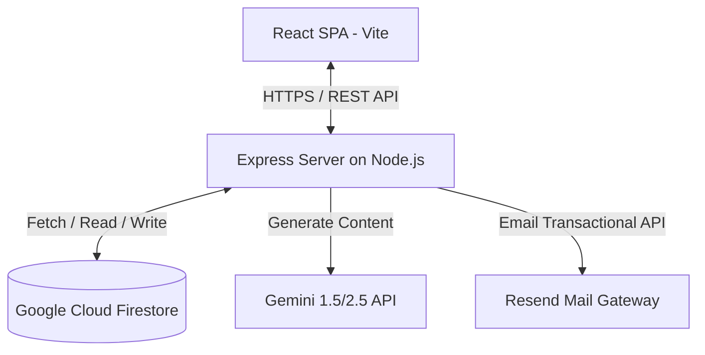

# Architecture Documentation

This document explains the technical architecture, data flows, technology choices, and scaling strategies for the AI Spend Audit application.

## 1. System Topology (Mermaid Diagram)

---

## 2. Dynamic Data Flow

Here is the exact step-by-step path of how a user's subscription inputs are converted into a shareable audit report:

1. **Input Submission**: The user enters their team size, use case, and selected AI tools (plans, seats, spend) into the React form.
2. **Local Calculations**: The inputs are formatted and fed into the deterministic Client/Server-shared **Audit Engine** (`/src/lib/auditEngine.ts`), immediately outputting savings metrics, plan comparisons, and structured savings justifications.
3. **Draft Render**: The UI immediately transitions to render high-fidelity charts, hero savings numbers, and individual recommendations.
4. **Summary Request**: The client requests `/api/summary` from the backend Express server, sending the structured audit results.
5. **LLM Synthesis**: The server proxies this data to Gemini (`gemini-2.5-flash`), transforming raw metrics into a highly tailored, professional financial summary. If Gemini is down or key is unconfigured, the server injects a custom-compiled fallback summary.
6. **Lead Capture**: When the user inputs their email to save the report, a POST is sent to `/api/lead`. The server performs validation, honeypot defense, and rate-limiting, writes the record to **Firestore** under `/leads`, and sends a transactional confirmation email.
7. **Social Sharing**: Clicking "Share" writes the anonymous report to Firestore under `/audits`. A custom shortened link (`/share/:id`) is returned. When visited, the Express backend reads this record, injects custom `<meta property="og:*">` tags inline, and returns a fully optimized, previewable page.

---

## 3. Tech Stack Rationale

Our tech stack consists of **Vite + React (TypeScript)** on the client, and **Node.js + Express** on the server. Here is why we selected this stack:

* **React + Vite**: Provides lightning-fast build speeds, optimized production asset bundles, and reactive state management crucial for highly responsive input forms.
* **Express.js**: Perfect lightweight framework to mount Vite's middleware during development while serving as a secure server-side API proxy to hide sensitive API keys (Gemini, Resend).
* **Google Cloud Firestore Database**: Provisioned instantly, supports frictionless JSON schema storage of irregular tool audits, scales automatically, and integrates with sub-millisecond document lookups.
* **Tailwind CSS**: Utility-first CSS allows compiling custom-crafted typography pairings and high-fidelity, device-responsive card components without bloated external UI packages.
* **Vitest**: Modern, ultra-fast test runner compatible with Vite's module resolution, enabling instantaneous local test validation.

---

## 4. Architectural Enhancements for High Load (10,000 Audits/Day)

To scale from a few dozen users to 10k audits per day comfortably, we would introduce the following changes:

1. **Redis Caching Layer**:
   * Audit configurations are highly repetitive. We would cache identical stack queries (e.g., 5-seat Claude Team with 1-seat Cursor) and the generated Gemini summaries in Redis to bypass LLM and DB requests.
2. **Serverless Function Deployment**:
   * Port the Express endpoints to serverless runtimes (such as Google Cloud Functions or Vercel Serverless) to auto-scale on traffic spikes without provisioning static VM overhead.
3. **Read Replicas & Connection Pooling**:
   * Introduce a Firestore/Database cache or use a global CDN edge (like Cloudflare Workers) to serve shared public URLs (`/share/:id`) instantly using static HTML caching, saving database read queries entirely.
4. **Asynchronous Background Task Queue**:
   * Move email dispatch (Resend API) and heavy LLM logging calls to an asynchronous background worker queue (e.g., BullMQ) to keep the HTTP response cycle ultra-lean (<50ms).
